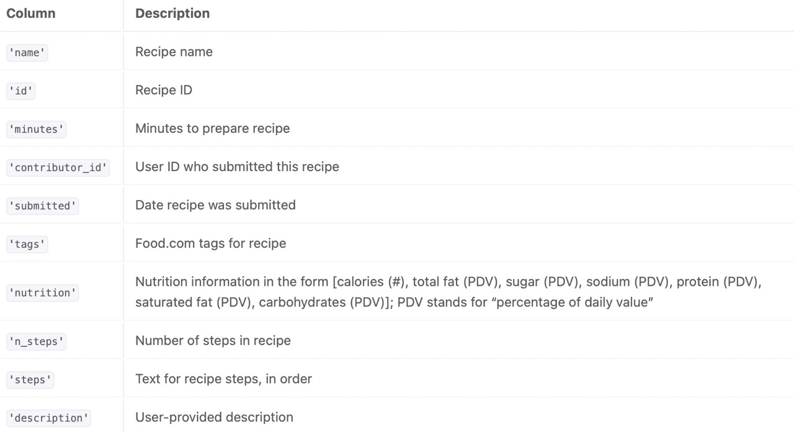
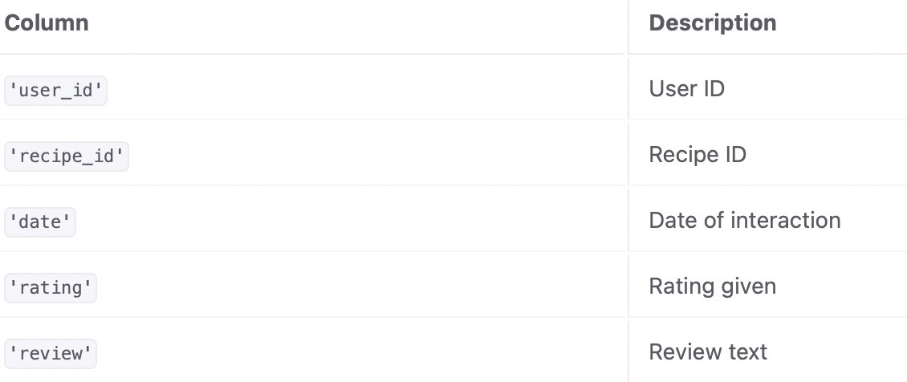

# Recipe-Data-Exploration

This project is for DSC80 at UCSD. 
by Amelia Lei and Kyra Deng

---

## Introduction

The world of cooking has taken a change as people start to take on fast-paced lifestyles. Thus, people tend to resort to eating out which may take a toll on one's health. To encourage people to cook more, we analyzed recipes based on their preparation times and nutrition to see what types of recipes people enjoy more. Since we know that many people don't have a lot of time on their hands, we will do our investigation on recipes that take 30 minutes or under to complete. 

The first dataset we are given contains information for 83782 recipes, and comes from food.com. It contains 10 columns, with the descriptions below. 

The second dataset we are given contains people's ratings on the recipes and also comes from food.com. It contains 5 columns, and has 731,927 total reviews. 

We will be working mostly with the ratings, nutrition, n_ingredients, n_steps, and minutes columns. 

## Data Cleaning and Exploratory Data Analysis

### Data Cleaning
Before conducting any analysis, we first merged the two datasets together to have one cohesive dataset to work with. The two dataframes have one column in common; the "id" and "recipe_id" columns. We merge on those columns and drop the "recipe_id" column. 
In the new merged dataframe, we noticed that there were ratings of 0s for some recipes, and replaced those with np.NaN because the 0 was not a true reflection of the ratings for those recipes. In this dataframe, there were repeated recipes since some recipes had multiple ratings, so we got a series of average ratings per each unique recipe and added that back to the dataframe. This dataframe is named 'final'.
We split up the values in the 'nutrition' column to individual columns named: 'calories (#)', 'total fat (PDV)', 'sugar (PDV)', 'sodium (PDV)', 'protein (PDV)', 'saturated fat (PDV)',  and 'carbohydrates (PDV)', with all the values in those columns being ints and we drop the 'nutrition' column. After checking the types of the values in the columns, we notice that the 'tags', 'steps' and 'ingredient' columns contains strings that are formatted like lists, so we changed the strings into actual lists with the commas in the original string representing the different elements within each list. We changed the 'submitted' and 'date' column from an object to a datetime data type. 
Lastly, since we want to work with quick recipes, or recipes that are 30 minutes or shorter, so we filter for those recipes only and recipes with less than 1000 calories so we can focus on a more specific dataset with less outliers.

The head of the left half of our cleaned dataframe:

| name                                |     id |   minutes |   contributor_id | submitted           | tags                                                                                                                                                                                                                                                                                                                                                             |   n_steps | steps                                                                                                                                                                                                                                                                                                                                | description                                                                                                                                                                                                                                   | ingredients                                                                                                                                                                  |   n_ingredients |   user_id |
|:------------------------------------|-------:|----------:|-----------------:|:--------------------|:-----------------------------------------------------------------------------------------------------------------------------------------------------------------------------------------------------------------------------------------------------------------------------------------------------------------------------------------------------------------|----------:|:-------------------------------------------------------------------------------------------------------------------------------------------------------------------------------------------------------------------------------------------------------------------------------------------------------------------------------------|:----------------------------------------------------------------------------------------------------------------------------------------------------------------------------------------------------------------------------------------------|:-----------------------------------------------------------------------------------------------------------------------------------------------------------------------------|----------------:|----------:|
| 5 tacos                             | 500166 |        20 |          2549237 | 2013-05-13 00:00:00 | ['weeknight', '30-minutes-or-less', 'time-to-make', 'course', 'main-ingredient', 'preparation', 'occasion', 'main-dish', 'beef', 'vegetables', 'easy', 'diabetic', 'dinner-party', 'kid-friendly', 'stove-top', 'dietary', 'comfort-food', 'inexpensive', 'ground-beef', 'meat', 'greens', 'lettuces', 'tomatoes', 'taste-mood', 'equipment', '3-steps-or-less'] |         5 | ['cook meat', 'add taco seasoning', 'place meat into taco shells / tortillas', 'top with tomatoes ', 'onions ', 'lettuce ', 'salsa and cheese', 'boil corn cobs 5-7 minutes']                                                                                                                                                        | costs about $5.00 to make.                                                                                                                                                                                                                    | ['ground beef', 'taco seasoning', 'taco shells', 'lettuce', 'tomatoes', 'onion', 'salsa', 'cheddar cheese', 'corn cobs']                                                     |               9 |    369715 |
| go to bbq sauce for ribs            | 495314 |        13 |           488441 | 2013-02-11 00:00:00 | ['15-minutes-or-less', 'time-to-make', 'course', 'cuisine', 'preparation', 'north-american', 'sauces', 'condiments-etc', 'american', 'easy', '3-steps-or-less']                                                                                                                                                                                                  |         3 | ['mix all ingredients together', 'heat on medium heat in a saucepan until bubbly', 'turn down and keep warm until ready to mop onto your meat']                                                                                                                                                                                      | this bbq sauce will stick to your ribs! you can also use it for chicken and pork, heck, just about any meat. if grilling, put sauce on during the last few minutes so it doesn’t just burn on your grill. serve additional sauce on the side. | ['tomato ketchup', 'dark brown sugar', 'applesauce', 'ponzu sauce', 'maple syrup', 'liquid smoke', 'apple cider vinegar', 'salt', 'oregano', 'granulated garlic', 'cayenne'] |              11 |    178427 |
| bbq spray recipe    it really works | 327356 |         5 |           398160 | 2008-09-26 00:00:00 | ['15-minutes-or-less', 'time-to-make', 'course', 'preparation', 'low-protein', 'healthy', '5-ingredients-or-less', 'very-low-carbs', 'condiments-etc', 'easy', 'low-fat', 'dietary', 'low-sodium', 'low-cholesterol', 'low-saturated-fat', 'low-calorie', 'low-carb', 'low-in-something']                                                                        |         5 | ['mix ingredients together and add to a clean spray bottle', 'spray and "wet" your bbq meat', 'seal the meat in a plastic bag and refrigerate at least 4 hours or overnight', 'grill the meat over indirect heat according to your recipe ', 'spraying every 15minutes during the cooking time', 'remove meat from grill and serve'] | using this marinade/spray will insure that your grilled meats are tender and tasty every time. try it on beef or pork ribs, beef brisket, pork butt or chicken. you'll love the results!                                                      | ['red wine vinegar', 'lemon juice', 'water']                                                                                                                                 |               3 |     90086 |
| bbq spray recipe    it really works | 327356 |         5 |           398160 | 2008-09-26 00:00:00 | ['15-minutes-or-less', 'time-to-make', 'course', 'preparation', 'low-protein', 'healthy', '5-ingredients-or-less', 'very-low-carbs', 'condiments-etc', 'easy', 'low-fat', 'dietary', 'low-sodium', 'low-cholesterol', 'low-saturated-fat', 'low-calorie', 'low-carb', 'low-in-something']                                                                        |         5 | ['mix ingredients together and add to a clean spray bottle', 'spray and "wet" your bbq meat', 'seal the meat in a plastic bag and refrigerate at least 4 hours or overnight', 'grill the meat over indirect heat according to your recipe ', 'spraying every 15minutes during the cooking time', 'remove meat from grill and serve'] | using this marinade/spray will insure that your grilled meats are tender and tasty every time. try it on beef or pork ribs, beef brisket, pork butt or chicken. you'll love the results!                                                      | ['red wine vinegar', 'lemon juice', 'water']                                                                                                                                 |               3 |    994510 |
| bbq spray recipe    it really works | 327356 |         5 |           398160 | 2008-09-26 00:00:00 | ['15-minutes-or-less', 'time-to-make', 'course', 'preparation', 'low-protein', 'healthy', '5-ingredients-or-less', 'very-low-carbs', 'condiments-etc', 'easy', 'low-fat', 'dietary', 'low-sodium', 'low-cholesterol', 'low-saturated-fat', 'low-calorie', 'low-carb', 'low-in-something']                                                                        |         5 | ['mix ingredients together and add to a clean spray bottle', 'spray and "wet" your bbq meat', 'seal the meat in a plastic bag and refrigerate at least 4 hours or overnight', 'grill the meat over indirect heat according to your recipe ', 'spraying every 15minutes during the cooking time', 'remove meat from grill and serve'] | using this marinade/spray will insure that your grilled meats are tender and tasty every time. try it on beef or pork ribs, beef brisket, pork butt or chicken. you'll love the results!                                                      | ['red wine vinegar', 'lemon juice', 'water']                                                                                                                                 |               3 |    305531 |

The head of the right half of our cleaned dataframe:

| date                |   rating | review                                                                                                                                                                                                                                                                                                                                                                                                                                   |   avg_rating |   calories (#) |   total fat (PDV) |   sugar (PDV) |   sodium (PDV) |   protein (PDV) |   saturated fat (PDV) |   carbohydrates (PDV) |
|:--------------------|---------:|:-----------------------------------------------------------------------------------------------------------------------------------------------------------------------------------------------------------------------------------------------------------------------------------------------------------------------------------------------------------------------------------------------------------------------------------------|-------------:|---------------:|------------------:|--------------:|---------------:|----------------:|----------------------:|----------------------:|
| 2013-06-13 00:00:00 |        4 | I doubled the recipe for my family but used two pounds of meat instead of 1.5 pounds. I followed the recipe except we did not use the onions and topped them with sour cream. I also didn&#039;t make the corn. We all enjoyed these.                                                                                                                                                                                                    |         4    |          249.4 |                26 |             4 |              6 |              39 |                    39 |                     0 |
| 2013-03-02 00:00:00 |        5 | Another great sauce for ribs! All the flavors blended nicely together and it was a snap to make. I used it as a mop sauce on grilled baby back ribs. Thanks for sharing and Good Luck in the contest.                                                                                                                                                                                                                                    |         5    |          233.5 |                 0 |           209 |             52 |               2 |                     0 |                    19 |
| 2008-09-28 00:00:00 |        5 | Yup, it does work, and is a much better method than using a mop, which tends to drown your coals (I only bbq with charcoal!). Also, I have tried using mop recipes in a spray bottle only to have the "dissolved" spices clog the sprayer and render it useless. Not so with this one - no spices! So now I just use a rub to season the meat before grilling, and spray with this concoction to moisten and flavor as we go. Great tip! |         4.75 |           47.2 |                 0 |             2 |              0 |               0 |                     0 |                     0 |
| 2008-10-19 00:00:00 |        5 | This really is a great barbecue tip. I've used this spray twice this month with great results.                                                                                                                                                                                                                                                                                                                                           |         4.75 |           47.2 |                 0 |             2 |              0 |               0 |                     0 |                     0 |
| 2011-12-05 00:00:00 |        5 | I'm new to grilling on charcoal by myself, and this worked really well. I seasoned a rib eye steak and let it sit for awhile to meld flavors. This spray kept it nice and moist. I really liked review by steve in Fl in that spices clogged up his sprayer - so this is the way that I will go from now on. Thanks Greg in San Diego for sharing a new favorite. Made for Healthy Choices Tag.                                          |         4.75 |           47.2 |                 0 |             2 |              0 |               0 |                     0 |                     0 |

### Univariate Analysis
<iframe
  src="graphs/univariate.html"
  width="800"
  height="600"
  frameborder="0"
></iframe>

The distribution is left-skewed, meaning that most recipes in the dataset have a high average rating. Over half of the recipes have an average rating around 5 stars. 

### Bivariate Analysis 
<iframe
  src="graphs/bivariate.html"
  width="800"
  height="600"
  frameborder="0"
></iframe>

The boxplot of the 26 to 30 group is the only boxplot that doens't contain any outliers. This may be because there is less variability and less recipes overall that require 26 to 30 ingredients. As the range of ingredients increaes, the number of outliers appears to decrease. As the ranges of ingredients increase, the median number of calories tends to increase as well.  

### Interesting Aggregates

|   avg_rating_est |   ('mean', 'sodium (PDV)') |   ('median', 'sodium (PDV)') |   ('std', 'sodium (PDV)') |   ('max', 'sodium (PDV)') |
|-----------------:|---------------------------:|-----------------------------:|--------------------------:|--------------------------:|
|                1 |                    45.4286 |                            7 |                  306.206  |                      4715 |
|                2 |                    41.8764 |                           11 |                  162.824  |                      2362 |
|                3 |                    17.5636 |                            9 |                   28.1599 |                       582 |
|                4 |                    21.5374 |                           11 |                   64.6724 |                      4727 |
|                5 |                    24.0827 |                           10 |                  114.777  |                      4717 |

We created a pivot table to examine the mean sodium content of recipes at each level of rating. In the aggregated data, we found that there is a significantly larger variability in the sodium content for 1 star recipes, and a significantly lower variability for 3 star recipes. The average sodium content of recipes that are deemed "lower quality" or "less enjoyable" (1 star and 2 star) are both in the 40s range, while the avergae sodium content for more reputable recipes (3 star and above) are in the 10s and 20s range. 

## Assessment of Missingness 
### NMAR Analysis

One column in the dataset wth missing values that may be NMAR is the  description column. The missingness may be due to the user thinking their recipe does not need a description because it is straightfoward enough. Another reasons may be ebcause the user does not have enough time to write a description on top of writing the rest of the recipe so they leave it out as it's not necesssary.

### Missingness Dependency 

Another column whose missingness we decided to investigate was the reviews column. While running our permutation tests to see if the distributions of the other columns remained the same when reviews was missing was when it was not, we found that the missigness of reviews does not depend on name but does depend on total fat. 

#### Rating and Total Fat (Dependent)

Null Hypothesis: The distribution of the total fat is the same when rating is missing and when it's not missing.

Alternative Hypothesis: The distribution of total fat is different when rating is missing and when it's not missing.

Test Statistic: Since total fat is a numerical variable, we use absolute difference in means as our test statistic

We reassigned the total fat column with a shuffled version of total fat. Then we ran a permutation test to test the dependency of the missingness of rating on total. From our permutation test, we got a p-value of 0.02 so we reject the null hypothesis at the alpha = 0.05 significance level. 

<iframe
  src="graphs/missingness1.html"
  width="800"
  height="600"
  frameborder="0"
></iframe>
<iframe
  src="graphs/distribution1.html"
  width="800"
  height="600"
  frameborder="0"
></iframe>

#### Rating and N Steps (Independent)

Null Hypothesis: The distribution of the n_steps is the same when rating is missing and when it's not missing.

Alternative Hypothesis: The distribution of n_steps is different when rating is missing and when it's not missing.

Test Statistic: Since n_steps is a numerical variable, we use absolute difference in means as our test statistic

We reassigned the n_steps column with a shuffled version of n_steps. Then we ran a permutation test to test the dependency of the missingness of rating on n_steps. From our permutation test, we got a p-value of 0.37 so we fail to reject the null hypothesis at the alpha = 0.05 significance level. 

<iframe
  src="graphs/missingness2.html"
  width="800"
  height="600"
  frameborder="0"
></iframe>
<iframe
  src="graphs/distribution2.html"
  width="800"
  height="600"
  frameborder="0"
></iframe>

## Hypothesis Testing
Null Hypothesis: There is no correlation between average recipe rating and the amount of sodium in each individual recipe. 

Alternate Hypothesis: There is significant correlation between average recipe rating and the amount of sodium in each individual recipe. 

Test statistic: absolute value of Pearson's R
We chose the absolute value of Pearson's R because we want to see how strong of a correlation there is between the average recipe rating and the amount of soduium in each recipe. We take the absolute value because we want to see if there is any relationship between the two columns, not if there is a negative or positive relationship present. 

We end up with an R value of 0.006323716062416152, and a p-value of 0.045529470241813606. With significance level alpha=0.05, we fail to reject the null in favor of the alternate, where there is a correlation between the average recipe rating and the amount of sodium in each individual recipe. 

## Framing a Prediction Problem
We want to predict the rating for a recipe based on its features. To do this, we will be performing a multi-class classification as we are predicting whether the recipe will a 0 star, 1 star, 2 star, 3 star, 4 star, or 5 star recipe. 
Our response variable is the rating of the recipe. We created a new column that rounded the average rating to use as our 'y'. We chose this because rating represents the likability of the recipe which is aligned with the goals of our prediction problem and our data exploration. 
We will only use features of the dataset that are available at the time of our prediction. These are features that are known before someone has tried the recipe such as the number of ingredients, number of steps, nutrition facts (calories, sodium, carbohydrates, etc.), and description. We will not use review in our model training as that is that information that we would know before a user has tried the recipe. 
The evaluation metric we chose was accuracy. Although the initial dataset is unbalanced due to a disproportionate amount of 5 star ratings, we will preprocess the data so that the training set consists of an equal amount of randomly sampled 1 star, 2 star, 3 star, 4 star, and 5 star ratings. Thus, accuracy the most appropriate evaluation metric over other metrics like F1 score because it works best on balanced data. 

## Baseline Model
For our baseline model, we used the nutritional facts and 'number of ingredients' columns as our predictors because they correlated the most with our target variable. We created the 'number of ingredients' column earlier to group 'n_ingredients' into these categories: '0 to 5', '6 to 10','11 to 15','16 to 20','21 to 25','26 to 30' , and 'over 30'. There are 7 nominal features, and one categorical feature. For the nomical features, we used StandardScaler() to standardize all the values, and for the categorical column, we used the OneHotEncoder(). The accuracy score ended up being around 0.352, which is not good. This may be beacuse there are many other features of a recipe that contribute to the rating that isn't accounted for yet in our model. Right now, we are only looking at the ingredients and nutritional value, but rating can also be affected by factors like complexity. 

## Final Model
We engineered 2 new features, and added two more columns from the dataset to transform. The first feature we created was the recipe complexity which we got by adding the number of steps and number of minutes for each recipe. We chose this because the more complex a recipe is, the lower the raitng might be since we narrowed the dataset down to quick 30 minute recipes so a higher complexity may seem like too much work. For the second feature, we wanted to analyze the ratio of protein to calories. A lot of people who are looking for quick recipes would also want there to be a higher protein to calorie ratio for its health benefits, and they might give it a higher rating if its healthier and more beneficial. We also decided to use the TfidfVectorizer() on the 'ingredients' and 'description' column because there may be certain keywords or ingredients that tend to correlate to a higher or lower rating. In order to select the best hyperparameters, we did a grid search on 'max_depth', 'min_samples_split', and 'criterion' with a cross validation of 5. The best hyperparameters were a a 'max_depth' of 18, 'min_samples_split' of 2, and 'criterion' of entropy. In the end, our final model had an accuracy of 0.432 which is 8% higher than the baseline. 

## Fairness Analysis
In our fairness analysis, we wanted to test if our model performed worse on recipes that were considered snacks. This means our Group X was recipes that we categorized as a snack (under 250 calories) and our Group Y was recipes that we categorized as a meal (over 250 calories).

Evaluation Metric: Accuracy

Null Hypothesis: The classifier's accuracy is the same for both snacks and meals, and any differences are due to chance

Alternative Hypothesis: The classifier's accuracy is higher for meals

Test Statistic: Difference in accuracy (meal - snack)

Significance Level: alpha = 0.05

After running our permutation test, we got a p-value of 0.68. Therefore, we fail to reject the null hypothesis at the 0.05 significance level, meaning that the classifier achieves accuracy parity. 

<iframe
  src="graphs/fairness_analysis.html"
  width="800"
  height="600"
  frameborder="0"
></iframe>

